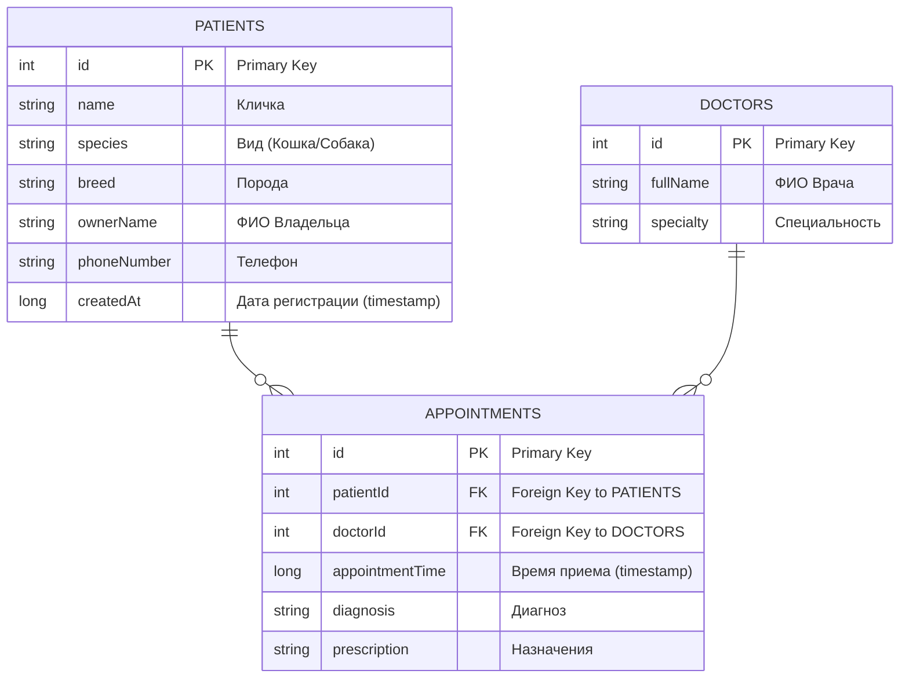

# Veterinary Clinic App 

Тестовое задание: Приложение для управления ветеринарной клиникой.

Приложение демонстрирует современный подход к Android-разработке, реализуя полный цикл работы с данными (CRUD) для пациентов, врачей и записей на прием.

##  Скриншоты

| Главный экран | Карточка пациента | Список врачей |
| :---: | :---: | :---: |
|  |  |  |

---

##  Технологический стек

*   **Язык:** Kotlin
*   **UI:** Jetpack Compose 
*   **Архитектура:** Clean Architecture (Presentation, Domain, Data) + MVVM 
*   **Dependency Injection:** Hilt
*   **Асинхронность:** Coroutines + Flow
*   **База данных:** Room (SQLite)
*   **Навигация:** Jetpack Navigation Compose

---

##  1. Схема базы данных (Database Schema)

Выполнен пункт ТЗ: *"Создать схему базы данных для описанных функций"*.
В приложении используется реляционная база данных Room с тремя сущностями. Настроены связи **One-to-Many** через Foreign Keys и каскадное удаление.

### Детальное описание сущностей и связей:

#### **`PATIENTS`**
*   **Назначение:** Хранит основную информацию о пациентах-животных и их владельцах.
*   **`id`**: Первичный ключ (Primary Key), автоинкремент.

#### **`DOCTORS`**
*   **Назначение:** Справочник врачей, работающих в клинике.
*   **`id`**: Первичный ключ (Primary Key), автоинкремент.

#### **`APPOINTMENTS`**
*   **Назначение:** Таблица-связка, представляющая собой медицинскую запись (прием).
*   **`id`**: Первичный ключ (Primary Key), автоинкремент.
*   **Связи (Foreign Keys):**
    *   `patientId` ссылается на `id` из таблицы `PATIENTS`.
    *   `doctorId` ссылается на `id` из таблицы `DOCTORS`.
*   **Ограничение (`ON DELETE CASCADE`):** При удалении пациента или врача из их таблиц, все связанные с ними записи в `APPOINTMENTS` будут **автоматически удалены**. Это обеспечивает целостность данных.

---

##  2. Объектная модель (Object Model)

Выполнен пункт ТЗ: *"Создать объектную модель приложения"*.
Приложение разделено на слои, каждый из которых имеет свои модели данных, чтобы соблюсти принцип **Separation of Concerns**.

### Domain Layer (Бизнес-логика)
Чистые Kotlin-объекты, не зависящие от фреймворков.
*   `Patient` — Основная сущность.
*   `Doctor` — Сущность врача.
*   `Appointment` — Агрегированная сущность записи (содержит уже расшифрованные имена врачей, а не просто ID).

### Data Layer (Хранение)
*   `PatientDbModel`, `DoctorDbModel` — Entities для Room.
*   `AppointmentWithDoctorTuple` — Специальная модель для сложных SQL-запросов с `@Relation` (JOIN таблиц).

---

##  Функционал

Приложение реализует все требуемые функции и даже больше:

1.  **Новый пациент:**
    *   Экран создания с валидацией полей (нельзя ввести буквы в телефон, обязательные поля подсвечиваются).
    *   Выбор вида животного из выпадающего списка.
2.  **Запись к врачу:**
    *   Возможность выбрать врача из существующего списка.
    *   Ввод диагноза и назначений.
3.  **Медицинские карточки:**
    *   Внутри экрана редактирования пациента отображается **история его болезней** (список всех записей).
4.  **Управление врачами:**
    *   Отдельный экран для добавления и удаления врачей.
5.  **Pre-populate:**
    *   При первом запуске база данных автоматически заполняется тестовыми данными (моками), чтобы приложение не выглядело пустым.
